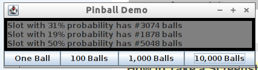

# pinball

A simple clojure program.  My first clojure coding ever.

## Usage

## License

Copyright © 2013 FIXME

Distributed under the Eclipse Public License either version 1.0 or (at
your option) any later version.
